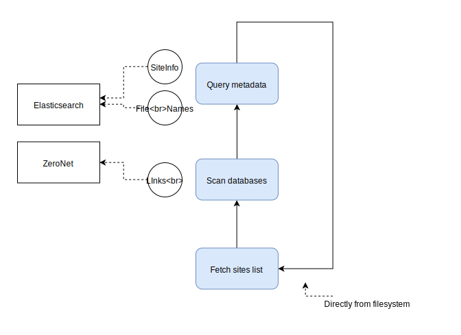

# HorizonSpider - Nodejs

  

HorizonPanel is included in HorizonSpider.

Actually, this is the third version. And it's not done yet

So, how it works.

## Two versions of sites

Centralized and decentralized

I will host it on a VPS, and offer full functionality of this search engine.

But it is not possible in decentralized way, we could only store metadata of the whole network in a zite.

## Basic concepts

The spider crawls each site in `siteList` and submit crawled links to zeronet.

Then zeronet processes them, and downloads these zites.

The crawler continues to traversal `siteList` and crawls newly downloaded sites to get more links

Also, it will store data in mongodb as cache for faster access.

## Usage

```bash
yarn
yarn crawl / serve
```



## Further plans

Write zeronet-js implementation
