# HorizonSpiderV2

A ZeroNet spider for Horizon Search Engine (Still in development)

This spider uses websocket to communicate with zeronet and crawls zites using the APIs.
So it's easier to develop now.

