# HorizonSpiderV2

A ZeroNet spider for Horizon Search Engine (Still in development)



This spider uses websocket to communicate with zeronet and crawls zites using the APIs.
So it's easier to develop now.

## Getting started

```bash
pip install -r requirements.txt
```

And download nltk resources

```py
import nltk
nltk.download("stopwords")
nltk.download("punkt")
```

## How does it crawl?


